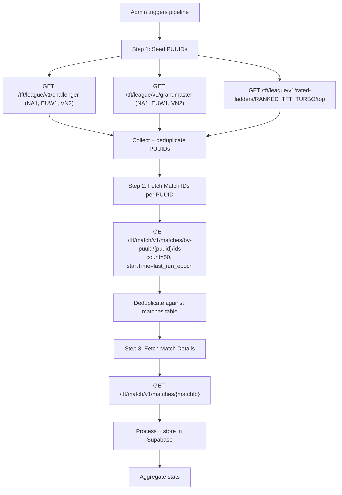

# Admin Dashboard Design Document

## 1. Architecture Overview

The Admin Dashboard is a protected section of the existing Next.js App Router application. It shares the same codebase and deployment but uses a dedicated layout that replaces the global `<Header>` / `<Footer>` shell with an admin-specific sidebar+topbar chrome.

Authentication and authorization are enforced at the middleware layer using Supabase Auth session cookies. The dashboard contacts Supabase directly via Server Actions and Route Handlers — no separate backend service is required for MVP.

```mermaid
graph TD
    Browser -->|Request /admin/*| Middleware
    Middleware -->|role !== admin| Redirect[Redirect to /]
    Middleware -->|role === admin| AdminLayout

    AdminLayout --> Overview[/admin]
    AdminLayout --> Augments[/admin/augments]
    AdminLayout --> Champions[/admin/champions]
    AdminLayout --> Sync[/admin/sync]
    AdminLayout --> Insights[/admin/insights]
    AdminLayout --> Users[/admin/users]

    Augments -->|Server Action| Supabase[(Supabase DB)]
    Champions -->|Server Action| Supabase
    Champions -->|fs.writeFileSync| JSONFiles[lib/champion-traits.json]
    Sync -->|spawn child_process| SyncScript[scripts/download-riot-data.mjs]
    SyncScript -->|upsert| Supabase
    SyncScript -->|SSE stream| SyncConsole[SyncConsole UI]
    Insights -->|Server Action| Supabase
    Users -->|Server Action| Supabase
    Overview -->|fetch| Supabase
```

---

## 2. Route Structure

All admin routes live under `app/admin/` and share `app/admin/layout.tsx`. The global `app/layout.tsx` wraps every page with `<Header>` and `<Footer>` — the admin layout must **override** this by rendering its own shell (sidebar + topbar) and suppressing the global chrome via a layout boundary.

> **Implementation note:** Use a nested `app/admin/layout.tsx` that renders a full-page shell div to replace the global header/footer visually. The root layout still wraps it, so the admin layout must be `position: fixed` or use `min-h-screen flex` to cover.

| Route | Component File | Access |
|---|---|---|
| `/login` | `app/login/page.tsx` | Public (redirects to `/admin` on success) |
| `/admin` | `app/admin/page.tsx` | Admin only |
| `/admin/augments` | `app/admin/augments/page.tsx` | Admin only |
| `/admin/champions` | `app/admin/champions/page.tsx` | Admin only |
| `/admin/sync` | `app/admin/sync/page.tsx` | Admin only |
| `/admin/insights` | `app/admin/insights/page.tsx` | Admin + Moderator |
| `/admin/users` | `app/admin/users/page.tsx` | Admin only |

Public routes added as part of this feature:

| Route | Description |
|---|---|
| `/insights` | Public Insights feed (approved posts only) |
| `/insights/[id]` | Single post reading view |
| `/insights/new` | Insight submission form (admin/moderator only for MVP) |

---

## 3. Authentication & Authorization

**Provider:** Supabase Auth (email/password for MVP).

**Role storage:** A `profiles` table mirrors `auth.users` with a `role` column. A database trigger auto-inserts a row into `profiles` whenever a new user is created in `auth.users`.

**Middleware** (`middleware.ts`):
```typescript
// Pseudocode
const session = await supabase.auth.getSession()
if (!session) return redirect('/login')

const { data: profile } = await supabase
  .from('profiles')
  .select('role')
  .eq('id', session.user.id)
  .single()

const role = profile?.role
const isAdminRoute = request.nextUrl.pathname.startsWith('/admin')
const isInsightsNew = request.nextUrl.pathname === '/insights/new'
const isModerator = role === 'moderator'
const isAdmin = role === 'admin'
const isInsightsModeration = request.nextUrl.pathname === '/admin/insights'

// Protect /admin/* (admin or moderator-on-insights only)
if (isAdminRoute) {
  if (!isAdmin && !(isModerator && isInsightsModeration)) {
    return redirect('/')
  }
}

// Protect /insights/new (any authenticated admin/moderator for MVP)
if (isInsightsNew && !session) {
  return redirect('/login')
}
```

---

## 4. Component Architecture

All admin-specific components live in `components/admin/`. They are not exported for use in the public-facing app.

### Shell Components
| Component | Responsibility |
|---|---|
| `AdminLayout` | Full-screen flex layout: sidebar + topbar + content area |
| `AdminSidebar` | Collapsible nav with icon + label links to each admin section |
| `AdminTopbar` | Environment indicator (Prod/Dev), Sync status badge, user avatar |

### Shared Data Components
| Component | Responsibility |
|---|---|
| `DataTable` | Generic sortable, filterable, paginated table. Accepts `columns` + `data` props |
| `InlineSelect` | Single-value inline edit dropdown with optimistic update. Used for augment tier |
| `InlineMultiSelect` | Multi-chip inline editor. Used for augment tags and champion traits |
| `StatusBadge` | Pill: `draft` / `pending` / `published` / `rejected` / `active` / `banned` |
| `MetricCard` | Stat card: label + value + optional trend delta |

### Feature-Specific Components
| Component | Responsibility |
|---|---|
| `SyncConsole` | Terminal-like log viewer. Consumes SSE stream from `/api/admin/sync/stream` |
| `ActionCard` | Large CTA card with icon, title, description, and trigger button |
| `AugmentRow` | Augment table row with inline tier select and multi-tag editor |
| `ChampionRow` | Champion table row with expandable inline trait multi-select |
| `InsightModerationRow` | Pending post row with preview toggle and Approve/Reject buttons |
| `UserRow` | User table row with role badge and inline role selector |

---

## 5. Database Schema

All tables live in Supabase (PostgreSQL). Supabase Auth manages `auth.users`.

```sql
-- Auto-created profile on user signup (via Supabase DB trigger)
CREATE TABLE profiles (
  id UUID PRIMARY KEY REFERENCES auth.users(id) ON DELETE CASCADE,
  role TEXT NOT NULL DEFAULT 'user' CHECK (role IN ('admin', 'moderator', 'user')),
  display_name TEXT,
  created_at TIMESTAMPTZ DEFAULT NOW()
);

-- DB trigger: auto-insert profile row when a new auth user is created
CREATE OR REPLACE FUNCTION handle_new_user()
RETURNS TRIGGER AS $$
BEGIN
  INSERT INTO public.profiles (id, role)
  VALUES (NEW.id, 'user');
  RETURN NEW;
END;
$$ LANGUAGE plpgsql SECURITY DEFINER;

CREATE TRIGGER on_auth_user_created
  AFTER INSERT ON auth.users
  FOR EACH ROW EXECUTE PROCEDURE handle_new_user();

-- Static game data (populated/upserted by sync script)
CREATE TABLE champions (
  id TEXT PRIMARY KEY,            -- e.g. TFT17_Ahri
  name TEXT NOT NULL,
  cost INTEGER NOT NULL DEFAULT 0,
  icon TEXT,
  set_prefix TEXT NOT NULL        -- e.g. TFT17
);

CREATE TABLE traits (
  id TEXT PRIMARY KEY,            -- e.g. TFT17_Invoker
  name TEXT NOT NULL,
  description TEXT,
  icon TEXT,
  set_prefix TEXT NOT NULL
);

-- Join table for champion <-> trait (replaces lib/champion-traits.json as source of truth)
-- NOTE: trait_name is intentionally denormalized (not FK to traits.id) to maintain
-- compatibility with the lib/champion-traits.json format consumed by the sync script.
CREATE TABLE champion_traits (
  champion_id TEXT REFERENCES champions(id) ON DELETE CASCADE,
  trait_name TEXT NOT NULL,       -- denormalized trait name string
  PRIMARY KEY (champion_id, trait_name)
);

-- Augment metadata (populated by sync, patched by admin)
CREATE TABLE augments (
  id TEXT PRIMARY KEY,            -- e.g. TFT17_Augment_InvokerCrown
  name TEXT NOT NULL,
  description TEXT,
  icon TEXT,
  tier TEXT DEFAULT 'Gold' CHECK (tier IN ('Silver', 'Gold', 'Prismatic')),
  tags TEXT[] DEFAULT '{}',
  set_prefix TEXT NOT NULL,
  updated_at TIMESTAMPTZ DEFAULT NOW()
);

-- Sync job history
CREATE TABLE sync_jobs (
  id UUID PRIMARY KEY DEFAULT gen_random_uuid(),
  set_prefix TEXT NOT NULL,        -- e.g. TFT17
  ddragon_version TEXT NOT NULL,   -- e.g. 17.1.1
  status TEXT DEFAULT 'running' CHECK (status IN ('running', 'completed', 'error')),
  champion_count INTEGER,
  trait_count INTEGER,
  augment_count INTEGER,
  item_count INTEGER,
  log_output TEXT,                 -- Full stdout/stderr captured (preserved even on error)
  started_at TIMESTAMPTZ DEFAULT NOW(),
  finished_at TIMESTAMPTZ
);

-- Community Insights
CREATE TYPE insight_status AS ENUM ('pending', 'published', 'rejected');

CREATE TABLE insights (
  id UUID PRIMARY KEY DEFAULT gen_random_uuid(),
  author_id UUID REFERENCES profiles(id) ON DELETE SET NULL,
  title TEXT NOT NULL,
  body TEXT NOT NULL,              -- Markdown string
  tags TEXT[] DEFAULT '{}',
  patch TEXT,                      -- Optional: TFT game version tag (e.g. '14.1') for archival context
  status insight_status DEFAULT 'pending',
  reviewed_by UUID REFERENCES profiles(id) ON DELETE SET NULL,
  created_at TIMESTAMPTZ DEFAULT NOW(),
  updated_at TIMESTAMPTZ DEFAULT NOW()
);
```

---

## 6. API & Server Action Contracts

### Sync Pipeline

**`POST /api/admin/sync/trigger`**
- Auth: Admin only
- Body: `{ set_prefix: string, ddragon_version: string }`
- Behavior: Spawns `download-riot-data.mjs` as a child process with env vars `TFT_SET_PREFIX` and `DDRAGON_VERSION`. Creates a `sync_jobs` row with `status: 'running'`. Returns `{ job_id: string }`.
- **Child process env vars:** `TFT_SET_PREFIX=TFT17`, `DDRAGON_VERSION=17.1.1`

**`GET /api/admin/sync/stream?job_id={id}`**
- Auth: Admin only
- Protocol: Server-Sent Events (SSE) — `Content-Type: text/event-stream`
- Behavior: Pipes child process stdout/stderr line-by-line as SSE events. On process exit, sends a final `event: done` message and updates `sync_jobs` record with status + counts.
- Client: `SyncConsole` component opens `EventSource` pointing to this route.

### Game Data – Augments

**`Server Action: updateAugment(id, { tier?, tags? })`**
- Auth: Admin only (checked inside action)
- Updates `augments` row in Supabase. Returns updated record for optimistic UI.

**`Server Action: getAugments(set_prefix)`**
- Fetches all augment rows for a given set prefix. Used on page load.

### Game Data – Champions

**`Server Action: getChampions(set_prefix)`**
- Fetches all champion rows for a given set prefix, joined with their current trait assignments from `champion_traits`. Used on page load.

**`Server Action: updateChampionTraits(champion_id, trait_names: string[])`**
- Auth: Admin only
- Deletes all rows from `champion_traits` for `champion_id`, inserts new rows.
- Also writes the full updated map back to `lib/champion-traits.json` on the server filesystem (so the sync script stays in sync).
- Returns updated champion record.

### Insights

**`Server Action: submitInsight({ title, body, tags })`**
- Auth: Any authenticated user
- Inserts row into `insights` with `status: 'pending'`, `author_id` from session.

**`Server Action: moderateInsight(id, action: 'approve' | 'reject')`**
- Auth: Admin or Moderator
- Updates `insights.status` and sets `reviewed_by`.

**`Server Action: getInsights({ status? })`**
- Auth: Admin/Moderator for non-published statuses. Public for `published`.

### Users

**`Server Action: updateUserRole(user_id, role: 'admin' | 'moderator' | 'user')`**
- Auth: Admin only
- Updates `profiles.role` for the given user.

---

## 7. Data Flow: Sync Script Parameterization

The sync script (`scripts/download-riot-data.mjs`) must be updated to read its configuration from environment variables instead of hardcoded constants:

```javascript
// Before (hardcoded)
const DDRAGON_VERSION = '16.7.1';
// filter: c.id.startsWith('TFT16_')

// After (parameterized)
const DDRAGON_VERSION = process.env.DDRAGON_VERSION || '16.7.1';
const TFT_SET_PREFIX = process.env.TFT_SET_PREFIX || 'TFT16';
const SUPABASE_URL = process.env.SUPABASE_URL;           // required for DB upsert
const SUPABASE_SERVICE_KEY = process.env.SUPABASE_SERVICE_KEY; // service role key (bypasses RLS)
// filter: c.id.startsWith(`${TFT_SET_PREFIX}_`)
```

**Required env vars for the sync script:**
```
DDRAGON_VERSION=17.1.1
TFT_SET_PREFIX=TFT17
SUPABASE_URL=https://xxx.supabase.co
SUPABASE_SERVICE_KEY=eyJ...   # service role key, NOT anon key
```

After generating `lib/generated-data.ts`, the script must also upsert into Supabase:
- `champions` table — upsert all champions with `set_prefix`
- `traits` table — upsert all traits
- `augments` table — upsert name/description/icon/set_prefix, but **preserve existing `tier` and `tags`** if already set by an admin. Use:
  ```sql
  INSERT INTO augments (...) VALUES (...)
  ON CONFLICT (id) DO UPDATE SET
    name = EXCLUDED.name,
    description = EXCLUDED.description,
    icon = EXCLUDED.icon,
    set_prefix = EXCLUDED.set_prefix
    -- tier and tags are NOT updated; admin overrides are preserved
  ```

---

## 8. Insight Platform UI Layout

### `/insights` (Public Feed)
- Grid of `InsightCard` components showing title, author, tags, creation date.
- Filter by tag. Only `status = 'published'` rows visible.

### `/insights/new` (Submission Form)
- Authenticated users only (middleware redirect).
- Simple form: title input + markdown textarea + tags input + submit button.
- On submit: calls `submitInsight` Server Action → redirects to a "Submitted for review" confirmation page.

### `/admin/insights` (Moderation Queue)
- `DataTable` filtered to `status = 'pending'`.
- Each row: `InsightModerationRow` with expand-to-preview and Approve/Reject buttons.
- Approved/rejected rows move out of the queue (filter updates).

---

## 9. Non-Functional Requirements

| Requirement | Design Decision |
|---|---|
| **Route security** | Middleware runs on every `/admin/*` and `/insights/new` request; no client-side role check is trusted |
| **Optimistic UI** | All inline edits use optimistic updates via `useOptimistic` (React 19) or local state |
| **SSE log streaming** | `SyncConsole` uses `EventSource` — gracefully degrades if SSE is not supported |
| **No RLS for MVP** | Server-side role checks in Server Actions replace Supabase RLS for simplicity; RLS can be added in a hardening pass |
| **File system writes** | `champion-traits.json` and `augment-tiers.json` writes happen server-side only; never in browser |
| **Dark mode** | Admin UI inherits the app's dark theme (`html.dark`). Admin chrome uses `bg-[#0f0d18]` sidebar, `bg-[#13111e]` content area |
| **Error boundaries** | All Server Action mutation paths must have error toast feedback in the UI. A top-level `error.tsx` boundary is added to `app/admin/` to catch unexpected render failures. |

---

## 10. Design Gaps & Open Decisions (Resolved)

| Question | Decision |
|---|---|
| DDragon version input | Admin provides version string in Sync UI input (`<input>` + validate semver format). Stored with the sync job record. |
| Log streaming mechanism | SSE (`/api/admin/sync/stream`). Simple, unidirectional, works over HTTP/2. |
| Moderator metadata access | Moderators can ONLY access `/admin/insights`. Augment + Champion management is admin-only. |
| Champion trait source of truth | Supabase `champion_traits` is the primary source. `lib/champion-traits.json` is regenerated on each admin save as a compatibility layer for the sync script until the script is updated to read from Supabase directly. |
| Trait assignment UX | Inline expandable row with a searchable `InlineMultiSelect`. No modal needed for MVP. |
| Insight content format | Markdown body stored as plain text. Rendered with a lightweight parser (e.g., `marked` or `react-markdown`) on the reading view. |
| Public Insights page | `/insights`, `/insights/[id]`, and `/insights/new` are all in scope for this feature. |
| Supabase RLS | Deferred to post-MVP hardening. Server-side checks only for now. |

---

## 11. Riot Live API — Match Data Pipeline

This section documents the full design for ingesting ranked match data from the Riot TFT API, transforming it into structured analytics rows, and aggregating comp/augment/item/trait statistics. The Admin Dashboard will include a trigger UI for this pipeline (Phase 3+ of planning).

### 11.1 API Endpoints Used

> **Scope clarification:** The pipeline purpose is **analytics data collection only** — ingesting match history from top-ranked players to build aggregated meta stats. There is no player profile search feature; players are not looked up by name. The Riot Account API (`/riot/account/v1`) is **not needed**.

| Step | Endpoint | Purpose |
|---|---|---|
| Seed | `GET /tft/league/v1/rated-ladders/{queue}/top` | Fetch top-rated Hyper Roll ladder players |
| Ladder | `GET /tft/league/v1/challenger` / `grandmaster` / `master` | Fetch standard ranked ladder players |
| Match IDs | `GET /tft/match/v1/matches/by-puuid/{puuid}/ids` | Get match IDs for each seeded player |
| Match Detail | `GET /tft/match/v1/matches/{matchId}` | Fetch full match data — **only endpoint containing actual match content** |

**✅ API coverage for the full pipeline is complete.** No additional Riot API endpoints are required.

**⚠️ One field to confirm before implementation:** `ParticipantDto.augments: string[]` — not listed in the official schema paste but present in real Set 5+ API responses. Log a raw match response from Set 16/17 to confirm field name before building `match_augments` insert logic.

**Regions & Routing:**

Riot requires a regional routing value for match endpoints (different from platform):

| Platform | Region Router |
|---|---|
| `na1` | `americas` |
| `euw1` | `europe` |
| `vn2` | `sea` |

```
Ladder:  https://{platform}.api.riotgames.com/tft/league/v1/challenger
Matches: https://{region}.api.riotgames.com/tft/match/v1/matches/by-puuid/{puuid}/ids
Detail:  https://{region}.api.riotgames.com/tft/match/v1/matches/{matchId}
```

---

### 11.2 TypeScript API Response Types

```typescript
// ── Rated Ladder (Hyper Roll) ──────────────────────────────────────
interface TopRatedLadderEntryDto {
  puuid: string;
  ratedTier: 'ORANGE' | 'PURPLE' | 'BLUE' | 'GREEN' | 'GRAY';
  ratedRating: number;
  wins: number;
  previousUpdateLadderPosition: number;
}

// ── Standard Ladder ────────────────────────────────────────────────
interface LeagueEntryDto {
  summonerId: string;
  puuid: string;
  leaguePoints: number;
  rank: string;          // I, II, III, IV
  tier: string;          // CHALLENGER, GRANDMASTER, MASTER
  wins: number;
  losses: number;
}

// ── Match List ─────────────────────────────────────────────────────
// GET /tft/match/v1/matches/by-puuid/{puuid}/ids
// Query params: start (default 0), count (default 20), startTime, endTime (epoch seconds)
// Returns: string[]  (match IDs)

// ── Match Detail ───────────────────────────────────────────────────
interface MatchDto {
  metadata: MetadataDto;
  info: InfoDto;
}

interface MetadataDto {
  data_version: string;
  match_id: string;
  participants: string[];   // list of puuids
}

interface InfoDto {
  endOfGameResult: string;
  gameCreation: number;     // Unix ms
  gameId: number;
  game_datetime: number;    // Unix ms
  game_length: number;      // seconds
  game_version: string;     // e.g. "Version 14.1.123.1234"
  mapId: number;
  participants: ParticipantDto[];
  queue_id: number;         // 1100 = Ranked, 1090 = Normal, 1130 = Hyper Roll
  tft_game_type: string;    // "standard" | "turbo"
  tft_set_core_name: string;
  tft_set_number: number;
}

interface ParticipantDto {
  companion: CompanionDto;
  gold_left: number;
  last_round: number;
  level: number;
  placement: number;        // 1–8
  players_eliminated: number;
  puuid: string;
  riotIdGameName: string;
  riotIdTagline: string;
  time_eliminated: number;
  total_damage_to_players: number;
  traits: TraitDto[];
  units: UnitDto[];
  win: boolean;
}

interface CompanionDto {
  content_ID: string;
  item_ID: number;
  skin_ID: number;
  species: string;
}

interface TraitDto {
  name: string;         // e.g. "TFT9_Invoker"
  num_units: number;
  style: number;        // 0=None 1=Bronze 2=Silver 3=Gold 4=Chromatic
  tier_current: number;
  tier_total: number;
}

interface UnitDto {
  character_id: string;     // e.g. "TFT9_Ahri"
  items: number[];          // item IDs (legacy int format)
  itemNames: string[];      // item string IDs (use this)
  name: string;             // often empty
  rarity: number;           // display rarity (≠ cost)
  tier: number;             // 1, 2, or 3 (star level)
}
```

---

### 11.3 Ingestion Pipeline Flow



**Rate Limits (actual):**

| Endpoint | Rate Limit |
|---|---|
| `GET /tft/match/v1/matches/{matchId}` | **250 req / 10 sec** |
| `GET /tft/match/v1/matches/by-puuid/{puuid}/ids` | 250 req / 10 sec |
| `GET /tft/league/v1/challenger` etc. | 20 req / sec, 100 req / 2 min |

**Two-endpoint flow (must use both in sequence):**

```
Step 2a: Endpoint /by-puuid/{puuid}/ids
         → returns string[] of match IDs only (no match data)
         → filter out IDs already in matches table (dedup)

Step 2b: Endpoint /matches/{matchId}
         → returns full MatchDto (participants, units, traits, augments)
         → only call for NEW match IDs not yet in DB
```

**Rate limit strategy for match detail fetching:**
- 250 req/10s = 25 req/sec effective throughput
- Use a token bucket or sliding window queue: release 1 request every ~40ms
- Process regions in parallel, but each region shares the same API key bucket
- Estimate: 500 PUUIDs × 20 new matches each = 10,000 match fetches ÷ 25/sec ≈ ~7 minutes per full run

**Deduplication:**
- Before fetching match detail, check if `match_id` already exists in the `matches` table.
- Pass `startTime` = Unix timestamp of last successful ingestion run (stored in `sync_jobs.finished_at`).

---

### 11.4 Processing Logic

#### Patch Detection
```typescript
// game_version format: "Version 14.1.456.1234"
function extractPatch(game_version: string): string {
  const match = game_version.match(/Version (\d+\.\d+)/);
  return match ? match[1] : 'unknown';
}
```

#### Queue Filtering
Only ingest ranked games:
```typescript
const RANKED_QUEUE_IDS = [1100, 1130]; // Standard Ranked + Hyper Roll
if (!RANKED_QUEUE_IDS.includes(info.queue_id)) return; // skip normals
```

#### Comp Signature Generation
```typescript
function buildCompSignature(units: UnitDto[]): string {
  // Take top 6 units by cost DESC (as a proxy for carry/importance), then alphabetical.
  // NOTE: rarity in the API is a display rarity (≠ cost). Using cost produces more stable
  // and semantically meaningful comp IDs. Confirm rarity↔cost mapping from a raw match
  // response before switching back to rarity.
  const coreUnits = [...units]
    .sort((a, b) => b.rarity - a.rarity || a.character_id.localeCompare(b.character_id))
    .slice(0, 6)
    .map(u => u.character_id)
    .sort(); // normalize order for hash stability
  return coreUnits.join('|'); // used as comp_id hash key
}
```

#### Active Trait Extraction
Only store traits where `style > 0` (i.e., at least 1 unit contributing):
```typescript
const activeTraits = participant.traits.filter(t => t.style > 0);
```

---

### 11.5 Database Schema — Match Data Tables

These tables extend the existing Supabase schema to store raw + processed match data.

```sql
-- Ingested match index (dedup guard + metadata)
CREATE TABLE matches (
  match_id TEXT PRIMARY KEY,                    -- e.g. NA1_1234567890
  region TEXT NOT NULL,                         -- na1, euw1, vn2
  patch TEXT NOT NULL,                          -- e.g. "14.1"
  queue_id INTEGER NOT NULL,
  tft_set_number INTEGER NOT NULL,
  game_datetime TIMESTAMPTZ NOT NULL,
  game_length FLOAT,
  ingested_at TIMESTAMPTZ DEFAULT NOW()
);

-- One row per player per match (8 rows per match)
CREATE TABLE player_matches (
  id UUID PRIMARY KEY DEFAULT gen_random_uuid(),
  match_id TEXT REFERENCES matches(match_id) ON DELETE CASCADE,
  puuid TEXT NOT NULL,
  riot_id_name TEXT,
  riot_id_tag TEXT,
  placement INTEGER NOT NULL,          -- 1–8
  level INTEGER,
  gold_left INTEGER,
  last_round INTEGER,
  total_damage INTEGER,
  time_eliminated FLOAT,
  players_eliminated INTEGER,
  win BOOLEAN NOT NULL,
  patch TEXT NOT NULL,
  comp_signature TEXT,                 -- hash of top-6 unit character_ids
  UNIQUE(match_id, puuid)
);

-- Units placed by a player in a match
CREATE TABLE match_units (
  id UUID PRIMARY KEY DEFAULT gen_random_uuid(),
  player_match_id UUID REFERENCES player_matches(id) ON DELETE CASCADE,
  character_id TEXT NOT NULL,          -- e.g. TFT17_Ahri
  tier INTEGER NOT NULL,               -- 1, 2, 3
  rarity INTEGER,
  item_names TEXT[] DEFAULT '{}'
);

-- Active traits for a player in a match
CREATE TABLE match_traits (
  id UUID PRIMARY KEY DEFAULT gen_random_uuid(),
  player_match_id UUID REFERENCES player_matches(id) ON DELETE CASCADE,
  trait_name TEXT NOT NULL,
  num_units INTEGER,
  tier_current INTEGER,
  style INTEGER                        -- 1=Bronze 2=Silver 3=Gold 4=Chromatic
);

-- Augments selected by a player in a match
-- Note: augments are in ParticipantDto.augments[] (string IDs)
CREATE TABLE match_augments (
  id UUID PRIMARY KEY DEFAULT gen_random_uuid(),
  player_match_id UUID REFERENCES player_matches(id) ON DELETE CASCADE,
  augment_id TEXT NOT NULL             -- e.g. TFT17_Augment_InvokerCrown
);
```

---

### 11.6 Aggregation Queries

Aggregation runs after each ingestion batch. Results are stored in pre-computed stat tables for fast frontend serving.

```sql
-- Comp stats (by patch)
CREATE TABLE comp_stats (
  id UUID PRIMARY KEY DEFAULT gen_random_uuid(),
  comp_signature TEXT NOT NULL,
  patch TEXT NOT NULL,
  sample_count INTEGER DEFAULT 0,
  avg_placement FLOAT,
  top4_rate FLOAT,       -- placement <= 4
  win_rate FLOAT,        -- placement = 1
  UNIQUE(comp_signature, patch)
);

-- Augment stats (by patch)
CREATE TABLE augment_stats (
  id UUID PRIMARY KEY DEFAULT gen_random_uuid(),
  augment_id TEXT NOT NULL,
  patch TEXT NOT NULL,
  sample_count INTEGER DEFAULT 0,
  avg_placement FLOAT,
  top4_rate FLOAT,
  win_rate FLOAT,
  UNIQUE(augment_id, patch)
);

-- Item stats (by patch)
CREATE TABLE item_stats (
  id UUID PRIMARY KEY DEFAULT gen_random_uuid(),
  item_name TEXT NOT NULL,
  patch TEXT NOT NULL,
  usage_count INTEGER DEFAULT 0,
  avg_placement FLOAT,
  top4_rate FLOAT,
  UNIQUE(item_name, patch)
);

-- Trait stats (by patch)
CREATE TABLE trait_stats (
  id UUID PRIMARY KEY DEFAULT gen_random_uuid(),
  trait_name TEXT NOT NULL,
  tier_current INTEGER NOT NULL,
  patch TEXT NOT NULL,
  sample_count INTEGER DEFAULT 0,
  avg_placement FLOAT,
  top4_rate FLOAT,
  UNIQUE(trait_name, tier_current, patch)
);
```

**Aggregation SQL example (comp stats):**
```sql
INSERT INTO comp_stats (comp_signature, patch, sample_count, avg_placement, top4_rate, win_rate)
SELECT
  comp_signature,
  patch,
  COUNT(*) AS sample_count,
  AVG(placement) AS avg_placement,
  ROUND(COUNT(*) FILTER (WHERE placement <= 4)::NUMERIC / COUNT(*), 4) AS top4_rate,
  ROUND(COUNT(*) FILTER (WHERE placement = 1)::NUMERIC / COUNT(*), 4) AS win_rate
FROM player_matches
WHERE patch = $1
GROUP BY comp_signature, patch
ON CONFLICT (comp_signature, patch) DO UPDATE SET
  sample_count = EXCLUDED.sample_count,
  avg_placement = EXCLUDED.avg_placement,
  top4_rate = EXCLUDED.top4_rate,
  win_rate = EXCLUDED.win_rate;
```

---

### 11.7 Admin Dashboard — Pipeline Trigger UI

The `/admin/sync` page will have **two distinct ActionCards**:

| Card | Action | API Route |
|---|---|---|
| **Sync DDragon Static Data** | Runs `download-riot-data.mjs` | `POST /api/admin/sync/trigger` (existing) |
| **Ingest Match Data** | Starts the Riot match ingestion pipeline | `POST /api/admin/pipeline/trigger` |

**`POST /api/admin/pipeline/trigger`**
- Body: `{ regions: ('na1' | 'euw1' | 'vn2')[], queue_ids: number[], max_matches_per_player: number }`
- Spawns a Node.js pipeline worker process (or calls a Supabase Edge Function for production).
- Returns `{ job_id }` — same SSE streaming pattern as DDragon sync.
- On completion, automatically runs aggregation queries and updates `comp_stats`, `augment_stats`, `item_stats`, `trait_stats`.

**Environment variables required:**
```
RIOT_API_KEY=RGAPI-xxxx-xxxx   # Riot developer or production API key
```

---

### 11.8 Serving Layer (Frontend API Routes)

These routes serve **aggregated analytics** to the public-facing frontend. Data comes entirely from pre-computed Supabase stat tables — **no live Riot API calls at serve time**.

> **No player profile search.** There is no `/player/[name]` or summoner lookup endpoint. Match history is ingested from top-ladder players purely for meta analytics. Players are not individually searchable in this system.

| Route | Query Params | Data Source | Returns |
|---|---|---|---|
| `GET /api/meta/comps` | `patch`, `limit` | `comp_stats` | `comp_stats[]` joined with unit data |
| `GET /api/meta/augments` | `patch` | `augment_stats` + `augments` | `augment_stats[]` joined with augment metadata |
| `GET /api/meta/items` | `patch` | `item_stats` | `item_stats[]` |
| `GET /api/meta/traits` | `patch` | `trait_stats` | `trait_stats[]` |

